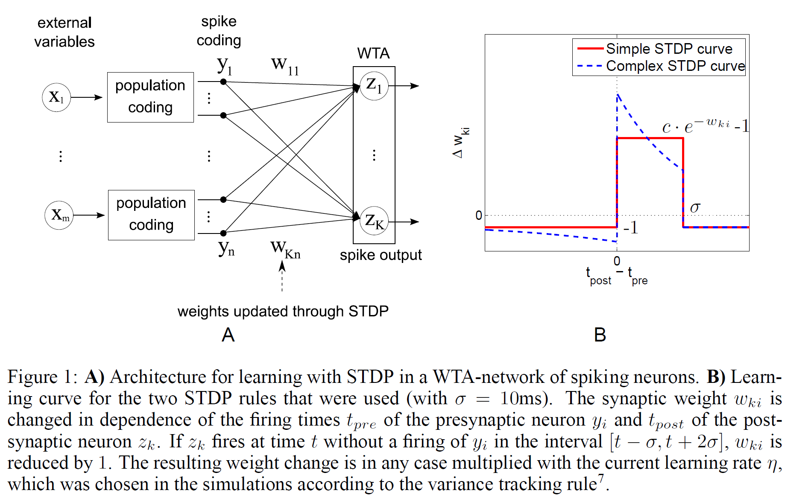

This paper is accepted to NIPS 2009. (Currently mainly called NeurIPS.)

## 2. Discovery of Hidden Causes for a Benchmark Dataset

Authors desinged a simple network that is working on MNIST dataset.

Population coding is utilized to encode real-valued input variables $\underline{\underline{x}}$ into binary-valued input $\underline{\underline{y}}$. More detailed explaination will be in [section 3](#3-underlying-theoretical-principles). Moreover, winner-takes-all (WTA) mechanism is applied to this architecture. There is one thing notable in WTA is the winning probability of each neuron, which follows softmax distribution:

$$
p(z_{k,t}=1|{\bf y}_t)
=
\frac{
        \exp(w_{ki}\tilde{y}_{ti}+w_{k0})
    }{
        \sum_{k'=1}^K\exp(w_{k'i}\tilde{y}_{ti}+w_{k'0})
    }\\
    \ \\
    \text{such that}\\
    \ \\
    \tilde{y}_{ti}
    =
    \begin{cases}
        1\qquad\text{if }\exist_{\ t-10\le t'\le t}:y_{t'i}=1\\
        0\qquad \text{otherwise.}
    \end{cases}

$$

Einstein summation convention is used to represent matrix multiplication.

But, why does $\tilde{y}_{ti}$ reflects the spikes of past? Authors say that it is a representation of EPSP, to facilitate the theoretical analysis henceforward. It does not affect the training of the SNN.

## 3. Underlying Theoretical Principles

Prior to looking at the analysis, allow me to formulate definitions and properties used within this paper. Some variables are changed for more legibility.

$$
\begin{align*}
    w_{ik}:&\text{weights from presynaptic $i^{\text{th}}$ neuron to postsynaptic $k^{\text{th}}$ neuron.}\\
    b_k:&\text{threshold of postsynaptic $k^{\text{th}}$ neuron.}\\
    \mathcal{N}_{\underline{\underline{w}}}:&\text{stochastic artificial neural network.}\\
    \underline{x}\in\{0,1\}^{M}:&\text{pixel values. Each is binarized from MNIST pixel brightness.}\\
    \underline{\underline{y}}\in\{0,1\}^{T\times mM}:&\text{population-coded input with Poisson distribution.}\\
    \underline{\underline{z}}\in\{0,1\}^{T\times K}:&\text{output vector such that }\forall t:\underline{z}_t\in\left\{z'\middle|\sum_{k=1}^K z_{tk}=1\right\}\\
    p\left(\underline{z}_{tk}=1\middle|\underline{y}_t,\underline{\underline{w}}\right)=&\frac{
        \exp\left(
            w_{ki}y_{ti}+b_{k}
        \right)
    }{\sum_{k'=1}^K{
        \exp\left(
            w_{k'i}y_{ti}+b_{k'}
        \right)
    }}
    =\left(
        \text{softmax}\left(
            \underline{\underline{w}}\,\underline{y}_t+\underline{b}
        \right)
    \right)_k
\end{align*}
$$

But, how does $\underline{\underline{y}}$ encoded? First, the pixel brightness of MNIST image is binarized to $0, 1$, making the binary input $\underline{x}$. This process removes some unimportant pixels (only $\le5%$ of the data is black in them). Second, encode $x_i$ into one-hot vector $y_{t,0},y_{t,1},\cdots,y_{t,m-1}$. For instance, for black pixel i, $x_i=0$, $\underline{y}_{t, [M(i-1),M(i-1)+1]}=(1,0)$. In this case, m=2, the same as in this paper. In fact, there are more population coding methods, but not used in this paper. [(Wikipedia-Neural Coding)](https://en.wikipedia.org/wiki/Neural_coding#Population_coding)

*WIP.*